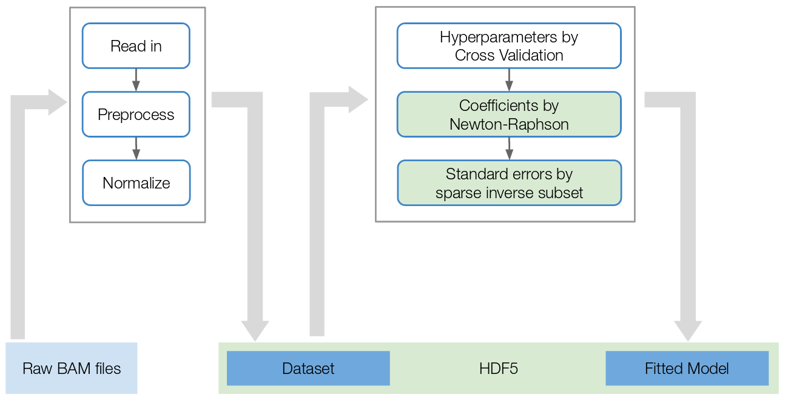

 

```{r setup, echo=FALSE, results="hide"}
knitr::opts_chunk$set(tidy=FALSE, cache=TRUE,
                      dev="png", 
                      message=FALSE, error=FALSE, warning=FALSE)
```

**Note:** if you use GenoGAM in published research, please cite:

> Stricker and Engelhardt, et al. (2017)
> GenoGAM: Genome-wide generalized additive models for ChIP-seq analysis
> *Bioinformatics*, **33**:15.
> [10.1093/bioinformatics/btx150](https://doi.org/10.1093/bioinformatics/btx150)

and

> Stricker, Galinier and Gagneur (2018)
> GenoGAM 2.0: scalable and efficient implementation of genome-wide generalized additive models for gigabase-scale genomes
> *BMC Bioinformatics*, **19**:247.
> [10.1186/s12859-018-2238-7](https://doi.org/10.1186/s12859-018-2238-7)

# Quick guide (for small organisms)

This is the brief version of the usual workflow of GenoGAM. It involves:

- Reading in data through `GenoGAMDataSet()` to get a `GenoGAMDataSet` object. This is done with the HDF5 backend.
  
- Computing size factors with `computeSizeFactors()`
  
- Compute the model with `genogam()` to get the result `GenoGAM` object

- compute position-wise log p-values with `computeSignificance()`

## Getting started

The example dataset is restricted to the first 100kb of the first yeast chromosome.

1. We set some required meta variables

```{r}
library(GenoGAM)

## A.
## specify folder and experiment design path
wd <- system.file("extdata/Set1", package='GenoGAM')
folder <- file.path(wd, "bam")
expDesign <- file.path(wd, "experimentDesign.txt")

## B.
## register parallel backend (default is "the number of cores" - 2)
BiocParallel::register(BiocParallel::MulticoreParam(worker = 2))

## C.
## specify chunk and overhang size.
chunkSize <- 50000
overhangSize <- 1000

## D.
## the experiment design reflecting the underlying GAM
## x = position
design <- ~ s(x) + s(x, by = genotype)
```

2. Read in the data to obtain a `GenoGAMDataSet` object.
```{r}
## build the GenoGAMDataSet
ggd <- GenoGAMDataSet(
  expDesign, directory = folder,
  chunkSize = chunkSize, overhangSize = overhangSize,
  design = design)

ggd
```

3. Compute Size factors

```{r}
## compute size factors
ggd <- computeSizeFactors(ggd)

ggd

## the data
assay(ggd)
```

## Fitting the model

1. Compute model with fixed hyperparameters

```{r}
## compute model without parameter estimation to save time in vignette
result <- genogam(ggd, lambda = 4601, theta = 4.51)

result

## the fit and standard error
fits(result)
se(result)
```

2. Compute log p-values
```{r}
computeSignificance(result)

pvalue(result)
```

Plot results of the center 10kb, where both tiles are joined together.
```{r}
ranges = GRanges("chrI", IRanges(45000, 55000))
plotGenoGAM(result, ranges = ranges)
```

# GenoGAM 2.0 workflow overview



# Standard ChIP-Seq analysis
Additional to the basic smoothing and point-wise significance computation this version of `r Biocpkg("GenoGAM")` now also supports differential analysis and peak calling with position-wise confidence intervals on ChIP-Seq data.

## Goal of the analysis
A small dataset is provided to illustrate the ChIP-Seq functionalities.
This is a subset of the data published by Thornton et al [@Thornton2014], who assayed histone H3 Lysine 4 trimethylation (H3K4me3) by ChIP-Seq comparing wild type yeast versus a mutant with a truncated form of Set1, the yeast H3 Lysine 4 methylase. The goal of this analysis is the identification of genomic positions that are significantly differentially methylated in the mutant compared to the wild type strain.

To this end, we will build a *GenoGAM* model that models the logarithm of the expected ChIP-seq fragment counts $y$ as sums of smooth functions of the genomic position $x$. Specifically, we write (with simplified notations) that:

\begin{equation}
	\log(\operatorname{E}(y)) = f(x) + \text{genotype} \times f_\text{mutant/wt}(x)
	(\#eq:mutantmodel)
\end{equation}

where genotype is 1 for data from the mutant samples, and 0 for the wild type. Here the function $f(x)$ is the reference level, i.e. the log-rate in the wild type strain. The function $f_\text{mutant/wt}(x)$ is the log-ratio of the mutant over wild-type. We will then statistically test the null hypothesis $f_\text{mutant/wt}(x) = 0$ at each position $x$. In the following we show how to build the dataset, perform the fitting of the model and perform the testing. 

## Registering a parallel backend
The parallel backend is registered using the `r Biocpkg("BiocParallel")` package. See the documentation in the `BiocParallel` class for the correct use. Also note, that `BiocParallel` is just an interface to multiple parallel packages. For example in order to use GenoGAM on a cluster, the `r CRANpkg("BatchJobs")` package might be required. The parallel backend can be registered at anytime as GenoGAM will just call the current one.

**IMPORTANT:** According to [this](https://support.bioconductor.org/p/70196/) and [this](https://stat.ethz.ch/pipermail/r-devel/2015-July/071554.html) posts on the Bioconductor support page and R-devel mailing list, the most important core feature of the *multicore* backend, shared memory, is compromised by Rs own garbage collector, resulting in a replication of the entire workspace across all cores. Given that the amount of data in memory is big (without the HDF5 backend) it might crash the entire system. **We highly advice to register the SnowParam backend** to avoid this **if working on larger organisms**. This way the overhead is a little bigger, but only necessary data is copied to the workers, keeping memory consumption relatively low. We never experienced a higher load than 4GB per core, usually it was around 2GB on human genome, which is even lower with the HDF5 backend.

```{r}
library(GenoGAM)

## On multicore machines by default the number of available cores - 2 are registered on the default backend 'Multicore'
BiocParallel::registered()[1]
```

For this small example we would like to assign less workers. Check `r Biocpkg("BiocParallel")` for other possible backends and more options for `SnowParam`
```{r}
BiocParallel::register(BiocParallel::SnowParam(workers = 3))
```

If we check the current registered backend, we see that the number of workers and the backend has changed.
```{r}
BiocParallel::registered()[1]
```

## Building a GenoGAMDataSet

BAM files restricted to the first 100kb of yeast chromosome I are provided in the `inst/extdata` folder of the `r Biocpkg("GenoGAM")` package. This folder also contains a flat file describing the experimental design.   

We start by loading the experimental design from the tab-separated text file `experimentDesign.txt` into a data frame:

```{r}
folder <- system.file("extdata/Set1", package='GenoGAM')

expDesign <- read.delim(
  file.path(folder, "experimentDesign.txt")
)

expDesign
```

Each row of the experiment design corresponds to the alignment files in BAM format of one ChIP sample. In case of multiplexed sequencing, the BAM files must have been demultiplexed. The experiment design have named columns. Three column names have a fixed meaning for `GenoGAMDataSet` and must be provided: *ID*, *file*, *paired*. The field *ID* stores a unique identifier for each alignment file. It is recommended to use short and easy to understand identifiers because they are subsequently used for labelling data and plots. The field *file* stores the BAM file name without the directory. The field *paired* is boolean with values *TRUE* for  paired-end sequencing data, and *FALSE* for single-end sequencing data. All other columns are taken as the experimental design and must be of binary type. The names of those columns must be identical to the names provided later in the design formula. It will allow us modeling the differential occupancy or call peaks later on. Here the important one is the *genotype* column.

We will now count sequencing fragment centers per genomic position and store these counts into a `GenoGAMDataSet` class. GenoGAM reduces ChIP-Seq data to fragment center counts rather than full base coverage so that each fragment is counted only once. This reduces artificial correlation between adjacent nucleotides. For single-end libraries, the fragment center is estimated by shifting the read end position by a constant. The estimation of this constant makes use of methods from the `r Biocpkg("chipseq")` package (See help of the `chipseq::estimate.mean.fraglen` method).

The parameters needed to create a `GenoGAMDataSet`are:

* the *experiment design* as either a path to the config file or a data.frame.
* the *directory* of the BAM files
* the *design* formula

```{r}
## build the GenoGAMDataSet
wd_folder <- file.path(folder, "bam")
ggd <- GenoGAMDataSet(
  expDesign, directory = wd_folder,
  design = ~ s(x) + s(x, by = genotype)
)

assay(ggd)

## overhang size
getOverhangSize(ggd)

## chunk size
getChunkSize(ggd)
```

The `GenoGAMDataSet` class stores this count data into a structure that index genomic positions over *tiles*, defined by `chunkSize` and `overhangSize`. A bit of background is required to understand these parameters. The smoothing in GenoGAM is based on splines (Figure 1), which are piecewise polynomials. The *knots* are the positions where the polynomials connect. In our experience, one knot every 20 to 50 bp is required for enough resolution of the smooth fits in typical applications. The fitting of generalized additive models involves steps demanding a number of operations proportional to the square of the number of knots, preventing fits along whole chromosomes. To make the fitting of GAMs genome-wide, GenoGAM performs fitting on overlapping intervals (*tiles*), and join the fit at the midpoint of the overlap of consecutive tiles. The parameters `chunkSize` and `overhangSize` defines the tiles, where the chunk is the core part of a tile that does not overlap other tiles, and the overhangs are the two overlapping parts.

Both variables influence the computation speed and memory usage as they define into how many (and how big) tiles the overall genome is being split for parallel computation. Additionally, a too small overhang size might cause jigged fits at junction points where the chunks are glued back together. Therefore it is advised to keep overhang size to be around 1kb (and is set like this by default). Chunk size is by default roughly estimated to fit the overall modelling problem without using too much memory. However, this estimation is a very simple heuristic, thus if problems are experienced  it is advised to set the chunk size yourself. We had good exerience with numbers between 50 - 100kb.


## More options with GenoGAMSettings and the HDF5 backend

For most genome sizes beyond the yeast genome, keeping all data in memory can be impractical or even impossible to fit. Therefore, the HDF5 backend is employed to store all relevant data on hard drive. This can be simply done by setting the parameter `hdf5` to true. This will also trigger a split of the underlying data into a list of data frames by chromosome. Splitting data is theoretically not necessary. However, due to problems of representing long integers in the Bioconductor infrastructure data frames of size biger than 2^31 (around 2.14 gigabase pairs) can not be stored easily or only through workarounds that would require more storage. Moreover, because HDF5 data is stored on hard drive it can be easily moved to a different device but has to be read-in again. To makes this easy, the parameter `fromHDF5` can be set to true, to trigger `GenoGAMDataSet` to read from already present HDF5 files.

```{r}
ggd <- GenoGAMDataSet(
  expDesign, directory = wd_folder,
  design = ~ s(x) + s(x, by = genotype), hdf5 = TRUE
)

## Note the difference in data type compared to the DataFrame above
assay(ggd)
```

By default, the HDF5 files are stored in the temp folder, which is impractical if the data has to be kept and shared. Therefore the HDF5 folder can be specified explicitly in the `GenoGAMSettings` object. This object holds a lot of meta parmeters which are responsible for the functionality of *GenoGAM*. In particular it guards the following areas:

* Reading-in and process data
* Parameter estimation during model fitting and cross-validation
* Data and storage control

All settings can be seen by just printing the `GenoGAMSettings` object. Additionally to the meta parameters it will also show the parallel backend information and the logger threshold, although both are not part of the `GenoGAMSettings` object.

```{r}
GenoGAMSettings()
```

### Reading in data

Reading in data is guarded by the `bamParams` slot. It makes direct use of the class `ScanBamParam` from the `r Biocpkg("Rsamtools")` package. Unless the data should be restricted to specific chromosomes, it is the easiest way to specify particular regions that should be read in. Chromosomes can be simply restricted through the `chromosomeList` slot. Finally, the 'center' slot just specifies if fragments should be centered or not.

```{r}
range <- GRanges("chrI", IRanges(30000, 50000))
params <- Rsamtools::ScanBamParam(which = range)
settings <- GenoGAMSettings(center = FALSE,
                            bamParams = params)

ggd <- GenoGAMDataSet(
  expDesign, directory = wd_folder,
  design = ~ s(x) + s(x, by = genotype),
  settings = settings)

## Note the higher counts
assay(ggd)
rowRanges(ggd)

## Now with chromosome specification. As only chrI is present
## in the example file, the read in will log an error and generate
## an empty GenoGAMDataSet object
settings <- GenoGAMSettings(chromosomeList = c("chrII", "chrIII"))

ggd <- GenoGAMDataSet(
  expDesign, directory = wd_folder,
  design = ~ s(x) + s(x, by = genotype),
  settings = settings)

## Empty GenoGAMDataSet due to lack of data in the example BAM file
length(ggd)
ggd
```

### Parameter estimation
Cross-validaton is performed to estimate the penalization parameter $\lambda$ and the dispersion parameter $\theta$. This is done iteratively maximising the likelihood, where each iteration involved performing one set of k-fold cross-validation. The default method maximising the likelihood function is Nelder-Mead, as the likelihood function can not be analytically specified and has no derivatives. The method can be changed to any method in Rs `optim` function, but the only reasonable candidate is *L-BFGS-B*. Moreover, the number of iterations can be changed. This is also true for the model fitting function. There, the number of maximum iterations and the threshold value can be changed.

```{r}
## Note, optimControl and estimControl is a list of more parameters. However none of them besides the shown are important
settings <- GenoGAMSettings(optimMethod = "L-BFGS-B", optimControl = list(maxit = 100L),
                            estimControl = list(eps = 1e-10, maxiter = 500L)) 
settings
```

### Data control

Probably the most important parameter to set through `GenoGAMSettings` is the HDF5 folder. Additionally, the compression level can also be changed as an integer between 0 (Lowest) and 9 (Highest). Note, with specifying the folder, the folder gets created!

```{r}
## set HDF5 folder to 'myFolder'
tmp <- tempdir()
settings <- GenoGAMSettings(hdf5Control = list(dir = file.path(tmp, "myFolder"), level = 0))
HDF5Array::getHDF5DumpDir()
HDF5Array::getHDF5DumpCompressionLevel()

## Another way to set this would be through the HDF5Array package
HDF5Array::setHDF5DumpDir(file.path(tmp, "myOtherFolder"))
settings
```

As it was mentioned before the fitted splines depend on the placement of knots. The more knots are placed the wigglier the fit and the more the spline has to be penalized to avoid overfitting. This is done automatically. However too little knots will lead to underfitting with no automatic resolution. The default setting is at one knot at every 20bp. Given our experience this is a conservative setting, that works for all applications. For example narrow peak calling might need more knots than broad peak calling as high resolution is required to be able to identify two very close peaks as two peaks instead of one. Because the computational fitting problem grows quadaratically with the number of knots, less knots might speed up computation. However, this might also lead to worse results given the downstream applicaton. Thus, this parameter should be handled with care.

Additionally, computation is speed up during cross-validation by using smaller tiles. Since $\lambda$ and $\theta$ are independent of length, smaller tiles can be used to speed up parameter estimation. The parameter is set as chunk size and defaults to 4kb. Generally one shouldn't go below 2kb as the computation it might become unstable in combination with sparse data.

```{r}
## For example, we choose a twice as long region but also two times less knots (double the knot spacing),
## which results in the same number of knots per tile as before.
settings <- GenoGAMSettings(dataControl = list(regionSize = 8000, bpknots = 40))
settings
````

**Note:** It is generally not advised to change the settings parameters, unless it is the specification of regions for data read-in or the HDF5 folder.

## Size factor estimation
Sequencing libraries typically vary in sequencing depth. Such variations is controlled for in GenoGAM by adding a sample-specific constant to the right term of Equation \@ref(eq:mutantmodel). The estimation of these constants is performed by the function `computeSizeFactor()` as follows:

```{r}
## read in data again, since the last read-in was an empty GenoGAM
ggd <- GenoGAMDataSet(
  expDesign, directory = wd_folder,
  design = ~ s(x) + s(x, by = genotype)
)

ggd <- computeSizeFactors(ggd)
sizeFactors(ggd)
````

**Note:** The size factors in GenoGAM are in the natural logarithm scale. Also factor groups are identified automatically from the design. Given more complex design, this might fail. Or, maybe different factor groups are desired. In this case the groups can be provided separatelly through the *factorGroups* argument.

## Model fitting
A GenoGAM model requires two further parameters to be fitted: the regularization parameter, $\lambda$, and the dispersion parameter $\theta$. The regularization parameters $\lambda$ controls the amount of smoothing. The larger $\lambda$ is, the smoother the smooth functions are. The dispersion parameter $\theta$ controls how much the observed counts deviate from their expected value modeled by Equation \@ref(eq:mutantmodel). The dispersion captures biological and technical variation which one typically sees across replicate samples, but also errors of the model. In GenoGAM, the dispersion is modeled by assuming the counts to follow a negative binomial distribution with mean $\mu=\operatorname{E}(y)$ whose logarithm is modeled by Equation \@ref(eq:mutantmodel) and with variance $v = \mu + \mu^2/\theta$.  

If not provided, the parameters $\lambda$ and $\theta$ are obtained by cross-validation. This step is too time consuming for a vignette. For sake of going through this example quickly, we provide the values manually:

```{r}
## fit model without parameters estimation
fit <- genogam(ggd, lambda = 4601, theta = 4.51)
fit
```

**Remark on parameter estimation:** To estimate the parameters $\lambda$ and $\theta$ by cross-validation, call `genogam()` without setting their values. This will perform a k-fold cross-validation on each tile with initial parameter values and iterate until convergence, often for about 30 iterations. The number of folds can be set with parameter *kfolds*. We recommend to do it for 20 to 40 different regions (the number can be set with parameter *regions*). During this procedure the underlying optimization algorithm (Nelder-Mead by default) will explore the possible parameter space. In case of low-count regions this might result in unstable matrix operations, in particular in resolutions of linear systems. To stabilize the computation a small first-order regularization might be added through the parameter *eps*. This will change the penalization term from $\beta^T \textbf{S} \beta$ to $\beta^T \textbf{S} \beta + \epsilon \textbf{I}$, where identity matrix $\textbf{I}$ is of the same dimension as penalty matrix $\textbf{S}$. The parameter *eps* represents $\epsilon$ in the equation above. Thus, a too large $\epsilon$ will also have a significant effect on the general fit, while a small $\epsilon$ will mostly affect small values close too zero. We recommend an $\epsilon$ value in the range of 1e-4 - 1e-3. 

An important difference of cross-validation in GenoGAM is that instead of leaving out data points, intervals are left out. This improves the parameter estimation by taking into account local correlation where leaving out single points might lead to overfitting. If replicates are present in the data the cross-validation can be further improved by using larger intervals (20bp by default) around the size of a ChIP-Seq fragment, i.e. 200bp. Thus, the large left out interval will be captured by the data in the replicate. 

```{r, eval = FALSE}
## Does not evaluate
fit_CV <- genogam(ggd, intervalSize = 200)
```

*Remark on parallel computing:*
If using the `SnowParams` backend, the initiation of a worker and copying relevant data might take a few seconds. Especially if this is done sequentially. During cross-validation, where computation is done on small tiles, computation might therefore be only a fraction of the total overhead. Therefore, the number of workers is automatically set to an optimal lower number during cross-validation and reset afterwards.

## Plotting results
Following the convention of the packages `r CRANpkg("mgcv")` and `r CRANpkg("gam")` the names of the fit for the smooth function defined by the *by* variable in the design formula (which is the same as the column name in the config) follow the pattern *s(x):by-variable*. Here, the smooth function of interest $f_\text{mutant/wt}(x)$ is thus named *s(x):genotype*.

```{r}
ranges = GRanges("chrI", IRanges(45000, 55000))
plotGenoGAM(fit, ranges = ranges)
```

Because the data is generally too big to plot in its totality. The plotting function requires a specifig range, which is best provided by a `GRanges` object and supplied to the *ranges* argument. Additionally, it can be specified if the smooths should be plotted on the same scale (*scale*), the values should be displayed in log format (*log*) or if the raw data count data should be included (provided *GenoGAMDataSet* to *ggd*, unfortunatelly hard to show in the vignette).

```{r}
plotGenoGAM(fit, ranges = ranges, scale = FALSE)
```

## Statistical testing
We test for each smooth and at each position $x$ the null hypothesis that it values 0 by a call to *computeSignificance()*. This gives us pointwise p-values. 

```{r}
computeSignificance(fit)
pvalue(fit)
```

## Differential binding
If region-wise significance is needed, as in the case of differential binding, then we call *computeRegionSignificance()*. This returns the provided `GRanges` object updated by a p-value and FRD column. If *smooth* is not provided it is computed for all smooths.

```{r}
gr <- GRanges("chrI", IRanges(c(1000, 7000), c(4000, 9000)))
db <- computeRegionSignificance(fit, regions = gr, smooth = "s(x):genotype")
db
```

## Peak calling
The computed fit allows for easy peak calling of narrow and broad peaks via the *callPeaks()*. The resulting `data.table` object provides a similar structure as the ENCODE narrowPeak and broadPeak format. Note, the *score* is given as the negative natural logarithm of the p-values. Also no peaks borders are provided (a function to compute them just as in GenoGAM 1.0 is being implemented). As this is not peak calling data, we use a high threshold do demonstrate the functionality.

```{r}
peaks <- callPeaks(fit, threshold = 1, smooth = "s(x):genotype")
peaks

peaks <- callPeaks(fit, threshold = 1, peakType = "broad",
                   cutoff = 0.75, smooth = "s(x):genotype")
peaks
```

The function *writeToBEDFile()* provides an easy way to write the peaks data.table to a *narrowPeaks* or *broadPeaks* file. The suffix will be determined automatically
```{r, eval = FALSE}
## Not evaluated
writeToBEDFile(peaks, file = 'myPeaks')
```

# FAQ

## Armadillo Error

**Problem:** An error occurs during model fitting along those lines:

`error: matrix multiplication: incompatible matrix dimensions: 22333830147200x5360120267008000 and 4294972496x1`

**Solution:** First, make sure you have all Armadillo dependencies installed correctly. See [here](http://arma.sourceforge.net/download.html)

Second, the error is most likely related to the fact, that Armadillo is using 32bit matrices, thus causing problems for large matrices GenoGAM is using. The solution is to enable `ARMA_64BIT_WORD`, which is not enabled in RcppArmadillo by default. This should have been done during compilation, but if it fails for some reason you can do it manually with `#define ARMA_64BIT_WORD 1` in `my_R_Directory/lib/R/library/RcppArmadillo/include/RcppArmadilloConfig.h`. See [here](https://stackoverflow.com/questions/40592054/large-matrices-in-rcpparmadillo-via-the-arma-64bit-word-define).

# Acknowledgments

We thank Alexander Engelhardt, Mathilde Galinier, Simon Wood, Herv\'e Pag\`es, and Martin Morgan for input in the development of GenoGAM

# Session Info

```{r}
sessionInfo()
```

# References

